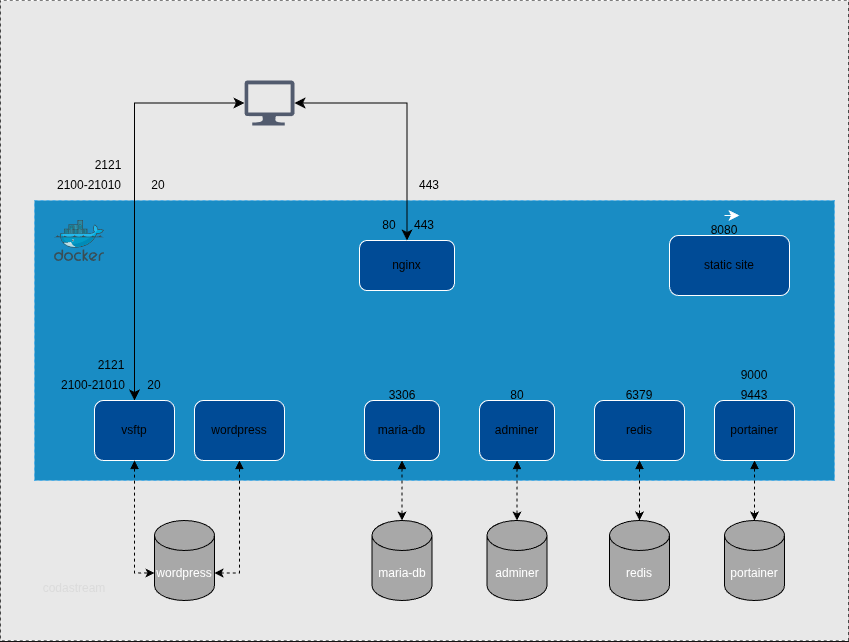

# Brief

This School 42 project consists of a complete infrastructure orchestration using Docker Compose. Each service runs in a dedicated container, built from Alpine Linux to ensure a minimal footprint and enhanced security.

## Developed skills

| Skill                                                                                                                           | Wiki                                                                                                                   |
| :------------------------------------------------------------------------------------------------------------------------------ | :--------------------------------------------------------------------------------------------------------------------- |
|               | [Docker](https://github.com/codastream/42-inception/wiki/Docker)                                                       |
|       | [Makefile](https://github.com/codastream/42-inception/wiki/Makefile)                                                   |
|  | [Secrets and Environment variables](https://github.com/codastream/42-inception/wiki/Secrets-and-Environment-variables) |
|   | [Alpine Linux](https://github.com/codastream/42-inception/wiki/Alpine-Linux)                                           |
|                 | [Nginx](https://github.com/codastream/42-inception/wiki/Nginx)                                                         |
|             | [MariaDB](https://github.com/codastream/42-inception/wiki/MariaDB)                                                     |
|         | [Wordpress](https://github.com/codastream/42-inception/wiki/Wordpress)                                                 |
|                 | [Redis](https://github.com/codastream/42-inception/wiki/Redis)                                                         |
|            | [FTP Server](https://github.com/codastream/42-inception/wiki/FTP-Server)                                               |
|           | [Static site](https://github.com/codastream/42-inception/wiki/Static-site)                                             |
|          | [Adminer](https://github.com/codastream/42-inception/wiki/Adminer)                                                     |
|         | [Portainer](https://github.com/codastream/42-inception/wiki/Portainer)                                                 |

 
 

# Architecture

# Wiki

https://github.com/codastream/inception/wiki
